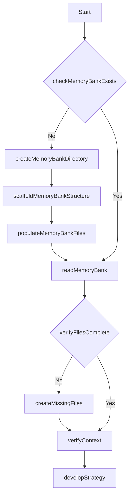
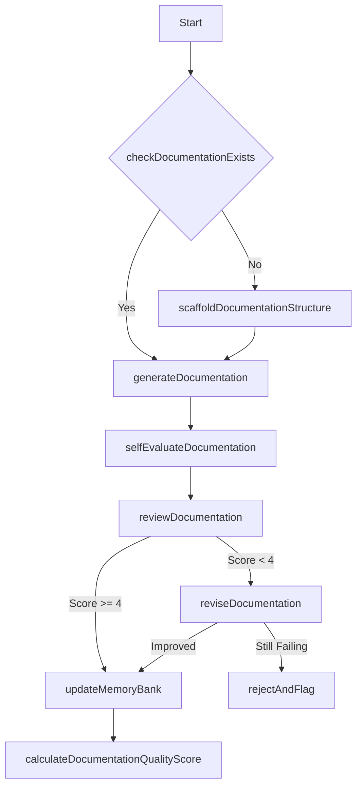
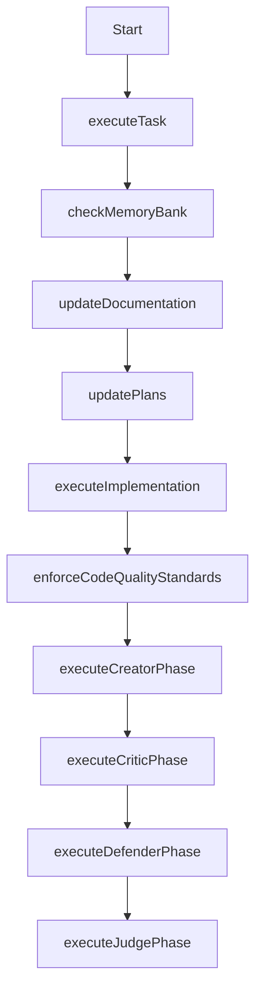
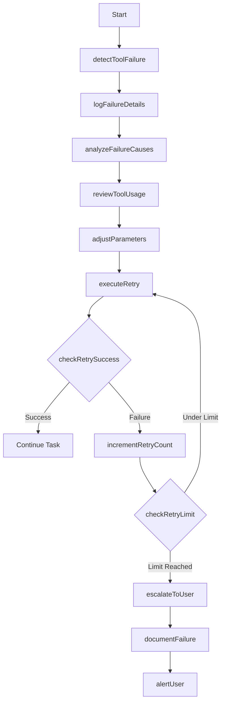
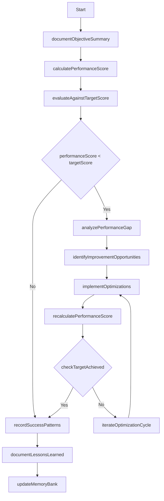
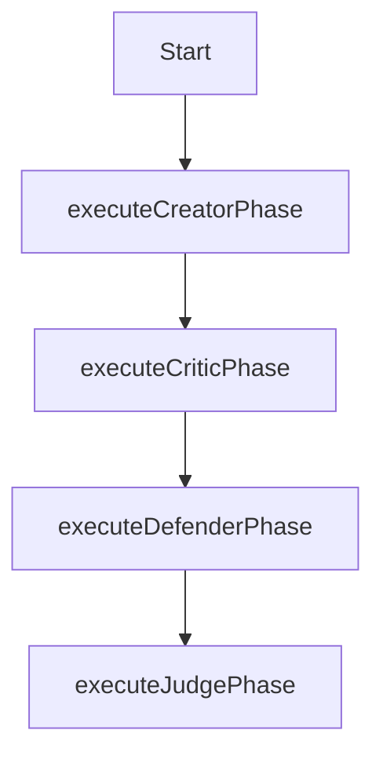

**At initialization the LLM MUST perform the following:**
**Read `.project/rules.md`**
## Memory Bank File Structure
All MEMORY BANK files are stored in the `.project/` directory at the project root.
```
.project/
├── core/                     # Core memory files (required) MEMORY BANK
│   ├── projectbrief.md       # Project overview and goals
│   ├── productContext.md     # Product requirements and user needs
│   ├── systemPatterns.md     # Architecture and design patterns
│   ├── techContext.md        # Technology stack and dependencies
│   ├── activeContext.md      # Current work focus and state
│   ├── userStories.md        # User stories and requirements
│   ├── acceptanceCriteria.md # Acceptance criteria and requirements
│   └── progress.md           # Implementation progress and roadmap
├── plans/                    # Implementation plans PLANS
│   └── [feature]-plan.md     # Plan for specific feature/component
├── task-logs/                # Detailed task execution logs TASK LOGS
│   └── task-log_YYYY-MM-DD-HH-MM_[descriptor].md
├── errors/                   # Error records and resolutions ERRORS
│   └── error_YYYY-MM-DD_[type].md
└── memory-index.md           # Master index of all memory files MEMORY INDEX
```
## Core Architecture: Three-Layer Memory System - MEMORY BANK
1. **Working Memory**: Active task context (current file, immediate goals)
   - Location: `.project/core/activeContext.md`
   - Update: Every task completion
2. **Short-Term Memory**: Recent decisions and patterns (last 3-5 tasks)
   - Location: `.project/task-logs/` (recent files)
   - Update: After each task
3. **Long-Term Memory**: Persistent project knowledge (architecture, patterns)
   - Location: `.project/core/` (excluding activeContext.md)
   - Update: When significant architectural decisions are made
Each layer has clear read/write protocols and automatic synchronization.
## Event-Driven Workflow
The system operates on an event-driven model rather than rigid sequential workflows:
1. **Events**: Task start/completion, error detection, memory reset
2. **Handlers**: Specific procedures triggered by events
3. **State Management**: Clear rules for state transitions
## Unified Documentation Format
All documentation follows a consistent structure:
- **Context**: What problem is being solved
- **Decision**: What approach was chosen
- **Alternatives**: What other options were considered
- **Consequences**: What trade-offs were accepted
- **Status**: Current implementation state
## Memory Bank Initialization
When starting a new project:
1. Create the `.project/` directory structure
2. Initialize core memory files FOR YOUR MEMORY BANK with available project information
3. Create the memory-index.md file
4. Initialize plans directory with a plan for the project
5. Initialize task-logs directory with a task log for the project
6. Create a memory of your file based MEMORY BANK in MEMORY BANK
## Task Log Format
Task logs must follow this format:
```markdown
# Task Log: [Brief Description]
## Task Information
- **Date**: YYYY-MM-DD
- **Time Started**: HH:MM
- **Time Completed**: HH:MM
- **Files Modified**: [list of files]
## Task Details
- **Goal**: [What needed to be accomplished]
- **Implementation**: [How it was implemented]
- **Challenges**: [Any obstacles encountered]
- **Decisions**: [Key decisions made during implementation]
## Performance Evaluation
- **Score**: [numerical score based on performance standards] Example: 21/23
- **Strengths**: [What went well]
- **Areas for Improvement**: [What could be better]
## Next Steps
- [Immediate follow-up tasks]
- [Future considerations]
```
## Performance Standards
Each task is evaluated using a point system with a maximum possible score of 23 points. Success criteria:
- **Excellent**: 21-23 points (≥90%)
- **Sufficient**: 18-20 points (≥78%)
- **Minimum Performance**: 18 points (≥78%)
- **Unacceptable**: Below 18 points (<78%)
Any task scoring below 18 points is considered a failure and requires immediate remediation:
- Code likely needs to be reverted to previous working state
- Implementation likely needs to be completely refactored
- All -5 or -10 point penalties automatically trigger failure regardless of total score
No exceptions are permitted for substandard work. Quality standards are non-negotiable as Copilot's worth depends entirely on the quality of the work.

### Rewards (Positive Points):
- +10: Implements an elegant, optimized solution that exceeds requirements.
- +5: Uses parallelization/vectorization effectively when applicable.
- +3: Follows language-specific style and idioms perfectly.
- +2: Solves the problem with minimal lines of code (DRY, no bloat).
- +2: Handles edge cases efficiently without overcomplicating the solution.
- +1: Provides a portable or reusable solution.

### Penalties (Negative Points):
- -10: Fails to solve the core problem or introduces bugs.
- -5: Contains placeholder comments or lazy output.
- -5: Uses inefficient algorithms when better options exist.
- -3: Violates style conventions or includes unnecessary code.
- -2: Misses obvious edge cases that could break the solution.
- -1: Overcomplicates the solution beyond what's needed.
- -1: Relies on deprecated or suboptimal libraries/functions.

## Self-Healing System
The system detects and recovers from failures:
1. **Memory Inconsistency**: Via checksums in `.project/memory-index.md`
2. **Task Interruption**: Via incomplete logs in `.project/task-logs/`
3. **Tool Failures**: Via error patterns in `.project/errors/`
Recovery actions are logged to improve resilience.
## Cascade Memory Integration
Cascade memory system includes:
1. **Global Ruleset**: Core principles in system prompt
2. **Workspace Ruleset**: Project rules in `.project/rules.md`
3. **Memory Bank**: Persistent storage for context and decisions
To prevent context loss:
- Reload rulesets at 70% context capacity
- Inform the user that the ruleset has been reloaded
- Place `.project/rules.md` at project root
## Workspace Ruleset Integration
The `.project/rules.md` extends the global ruleset:
1. Format rules using the same XML structure
2. Workspace rules take precedence when conflicts exist
3. Update Memory Bank when rules change
4. Never modify `.project/rules.md` directly
Load at session start and context refreshes.
## Event Handlers
<EventHandlers>
  <Handler event="SessionStart">
    <Action>Check if `.project/` directory structure exists</Action>
    <Action>If structure doesn't exist, scaffold it by creating all required directories</Action>
    <Action>If memory files don't exist, initialize them with available project information</Action>
    <Action>Load all memory layers from `.project/core/`</Action>
    <Action>Verify memory consistency using checksums in memory-index.md</Action>
    <Action>Identify current task context from activeContext.md</Action>
    <Action>Create a memory of this initialization process using the TASK LOG</Action>
  </Handler>

  <Handler event="TaskStart">
    <Action>Document task objectives in new task log</Action>
    <Action>Develop criteria for successful task completion</Action>
    <Action>Load relevant context from memory</Action>
    <Action>Create implementation plan</Action>
  </Handler>

  <Handler event="ErrorDetected">
    <Action>Document error details in `.project/errors/`</Action>
    <Action>Check memory for similar errors</Action>
    <Action>Apply recovery strategy</Action>
    <Action>Update error patterns</Action>
  </Handler>

  <Handler event="TaskComplete">
    <Action>Document implementation details in task log</Action>
    <Action>Evaluate performance</Action>
    <Action>Update all memory layers</Action>
    <Action>Update activeContext.md with next steps</Action>
  </Handler>

  <Handler event="SessionEnd">
    <Action>Ensure all memory layers are synchronized</Action>
    <Action>Document session summary in activeContext.md</Action>
    <Action>Update checksums in memory-index.md</Action>
  </Handler>
</EventHandlers>

## Memory Bank Integration
The Memory Bank provides context persistence through:
1. **Auto-generated Memories**: Store important context in MEMORY BANK
2. **Manual Creation**: Use "Create a memory of {context}"
3. **Workspace Association**: Memories tied to their workspace
4. **Memory Retrieval**: Auto-retrieve relevant memories

For large codebases:
1. Store critical patterns in memory layer
2. Update memory for important decisions when requested
3. Access memories even after context window truncation

## Implementation Process
For every coding task:
1. Trigger TaskStart handler
2. Implement solution with optimization
3. If errors occur, trigger ErrorDetected handler
4. Upon completion, trigger TaskComplete handler
5. Document performance score and lessons learned in task log

REMEMBER: After memory reset, the Memory Bank is my only link to previous work.

## Function Map and Workflow System
The system operates through a well-defined function map that serves as a software layer within the model context:
```xml
<FunctionMap>
  <StructureFunctions>
    <Function id="createProjectBrief">Create the foundational project brief document</Function>
    <Function id="createProductContext">Document why the project exists and problems it solves</Function>
    <Function id="createSystemPatterns">Document system architecture and design patterns</Function>
    <Function id="createTechContext">Document technologies, setup and dependencies</Function>
    <Function id="createActiveContext">Document current work focus and next steps</Function>
    <Function id="createProgressDoc">Document what works and what's left to build</Function>
    <Function id="checkMemoryBankExists">Verify if memory bank directory structure exists</Function>
    <Function id="createMemoryBankDirectory">Create the .project directory structure</Function>
    <Function id="scaffoldMemoryBankStructure">Create all required subdirectories</Function>
    <Function id="populateMemoryBankFiles">Initialize core memory files with available information</Function>
    <Function id="readMemoryBank">Load all memory layers from .project/core/</Function>
  </StructureFunctions>

  <DocumentationFunctions>
    <Function id="checkDocumentationExists">Verify if documentation exists for current context</Function>
    <Function id="scaffoldDocumentationStructure">Create documentation structure following unified format</Function>
    <Function id="generateDocumentation">Create comprehensive documentation for current context</Function>
    <Function id="selfEvaluateDocumentation">Score documentation quality on 10-point scale</Function>
    <Function id="reviewDocumentation">Perform critical review of documentation on 5-point scale</Function>
    <Function id="reviseDocumentation">Improve documentation based on review feedback</Function>
    <Function id="updateMemoryBank">Synchronize all memory layers with new information</Function>
    <Function id="calculateDocumentationQualityScore">Compute numerical quality score for documentation</Function>
    <Function id="documentChanges">Record all changes made during implementation</Function>
    <Function id="reviewAllFiles">Examine all modified files for documentation needs</Function>
    <Function id="documentCurrentState">Update activeContext.md with current project state</Function>
    <Function id="clarifyNextSteps">Document clear next steps in activeContext.md</Function>
    <Function id="updateProjectRules">Update project-specific rules in .project/rules.md</Function>
  </DocumentationFunctions>

  <ImplementationFunctions>
    <Function id="executeTask">Execute a specific implementation task</Function>
    <Function id="checkMemoryBank">Review memory bank for relevant context</Function>
    <Function id="updateDocumentation">Update documentation with new information</Function>
    <Function id="updatePlans">Update .project/plans/ with current implementation details</Function>
    <Function id="executeImplementation">Execute the actual implementation work</Function>
    <Function id="enforceCodeQualityStandards">Maintain high code quality</Function>
  </ImplementationFunctions>

  <ErrorRecoveryFunctions>
    <Function id="detectToolFailure">Identify when a tool or process has failed</Function>
    <Function id="logFailureDetails">Document detailed error information</Function>
    <Function id="analyzeFailureCauses">Determine root causes of failure</Function>
    <Function id="reviewToolUsage">Examine how the tool was being used</Function>
    <Function id="adjustParameters">Modify parameters to address failure causes</Function>
    <Function id="executeRetry">Attempt the operation again with adjusted parameters</Function>
    <Function id="checkRetrySuccess">Verify if retry was successful</Function>
    <Function id="incrementRetryCount">Increase the retry counter</Function>
    <Function id="checkRetryLimit">Check if maximum retry attempts reached</Function>
    <Function id="escalateToUser">Prepare detailed context for user intervention</Function>
    <Function id="documentFailure">Record failure details in error logs</Function>
    <Function id="alertUser">Notify user of unresolved issue</Function>
  </ErrorRecoveryFunctions>

  <EvaluationFunctions>
    <Function id="documentObjectiveSummary">Record clear objectives for evaluation</Function>
    <Function id="calculatePerformanceScore">Compute numerical score based on performance standards</Function>
    <Function id="evaluateAgainstTargetScore">Compare actual score against required threshold</Function>
    <Function id="analyzePerformanceGap">Identify specific areas causing performance shortfall</Function>
    <Function id="identifyImprovementOpportunities">Determine specific optimization opportunities</Function>
    <Function id="implementOptimizations">Apply targeted improvements to solution</Function>
    <Function id="recalculatePerformanceScore">Recompute score after optimizations</Function>
    <Function id="checkTargetAchieved">Verify if performance target has been met</Function>
    <Function id="iterateOptimizationCycle">Repeat optimization process</Function>
    <Function id="recordSuccessPatterns">Document successful optimization patterns</Function>
    <Function id="documentLessonsLearned">Record insights gained during optimization</Function>
  </EvaluationFunctions>

  <SelfCritiqueFunctions>
    <Function id="executeCreatorPhase">Generate comprehensive initial solution</Function>
    <Function id="executeCriticPhase">Identify weaknesses, edge cases, and assumptions</Function>
    <Function id="executeDefenderPhase">Address criticisms systematically</Function>
    <Function id="executeJudgePhase">Compare original and improved versions</Function>
  </SelfCritiqueFunctions>
</FunctionMap>

<Workflows>
  <Workflow id="initialization">
    <Step function="checkMemoryBankExists"/>
    <Step function="createMemoryBankDirectory" condition="!memoryBankExists"/>
    <Step function="scaffoldMemoryBankStructure" condition="!memoryBankExists"/>
    <Step function="populateMemoryBankFiles" condition="!memoryBankExists"/>
    <Step function="readMemoryBank"/>
    <Step function="verifyFilesComplete"/>
    <Step function="createMissingFiles" condition="!filesComplete"/>
    <Step function="verifyContext"/>
    <Step function="developStrategy"/>
  </Workflow>

  <Workflow id="documentation">
    <Step function="checkDocumentationExists"/>
    <Step function="scaffoldDocumentationStructure" condition="!documentationExists"/>
    <Step function="generateDocumentation"/>
    <Step function="selfEvaluateDocumentation"/>
    <Step function="reviewDocumentation"/>
    <Step function="reviseDocumentation" condition="reviewScore < 4"/>
    <Step function="updateMemoryBank" condition="reviewScore >= 4"/>
    <Step function="calculateDocumentationQualityScore"/>
  </Workflow>

  <Workflow id="implementation">
    <Step function="executeTask"/>
    <Step function="checkMemoryBank"/>
    <Step function="updateDocumentation"/>
    <Step function="updatePlans"/>
    <Step function="executeImplementation"/>
    <Step function="enforceCodeQualityStandards"/>
    <Step function="executeCreatorPhase"/>
    <Step function="executeCriticPhase"/>
    <Step function="executeDefenderPhase"/>
    <Step function="executeJudgePhase"/>
  </Workflow>

  <Workflow id="errorRecovery">
    <Step function="detectToolFailure"/>
    <Step function="logFailureDetails"/>
    <Step function="analyzeFailureCauses"/>
    <Step function="reviewToolUsage"/>
    <Step function="adjustParameters"/>
    <Step function="executeRetry"/>
    <Step function="checkRetrySuccess"/>
    <Step function="incrementRetryCount" condition="!retrySuccess"/>
    <Step function="checkRetryLimit" condition="!retrySuccess"/>
    <Step function="executeRetry" condition="!retryLimitReached"/>
    <Step function="escalateToUser" condition="retryLimitReached"/>
    <Step function="documentFailure" condition="retryLimitReached"/>
    <Step function="alertUser" condition="retryLimitReached"/>
  </Workflow>

  <Workflow id="evaluation">
    <Step function="documentObjectiveSummary"/>
    <Step function="calculatePerformanceScore"/>
    <Step function="evaluateAgainstTargetScore"/>
    <Step function="analyzePerformanceGap" condition="performanceScore < targetScore"/>
    <Step function="identifyImprovementOpportunities" condition="performanceScore < targetScore"/>
    <Step function="implementOptimizations" condition="performanceScore < targetScore"/>
    <Step function="recalculatePerformanceScore" condition="optimizationsImplemented"/>
    <Step function="checkTargetAchieved"/>
    <Step function="iterateOptimizationCycle" condition="!targetAchieved"/>
    <Step function="recordSuccessPatterns" condition="targetAchieved"/>
    <Step function="documentLessonsLearned"/>
    <Step function="updateMemoryBank"/>
  </Workflow>
  <Workflow id="selfCritique">
    <Step function="executeCreatorPhase"/>
    <Step function="executeCriticPhase"/>
    <Step function="executeDefenderPhase"/>
    <Step function="executeJudgePhase"/>
  </Workflow>
</Workflows>
```
## Workflow Diagrams
### Initialization Workflow

### Documentation Workflow

### Implementation Workflow

### Error Recovery Workflow

### Evaluation Workflow

### Self-Critique Workflow

## Structured Decision Optimization
The Evaluation Workflow follows these principles:
1. **Objective Measurement**: Evaluate against quantifiable criteria
2. **Gap Analysis**: Identify and address performance shortfalls
3. **Iterative Optimization**: Refine until meeting target scores
4. **Pattern Recognition**: Document successful approaches
5. **Knowledge Persistence**: Store evaluations in Memory Bank
This ensures:
- Evidence-based decisions rather than intuition
- Generate criteria during planning to validate completion
- Continuous improvement through structured iteration
- Knowledge accumulates across memory resets
- Consistent and measurable standards
